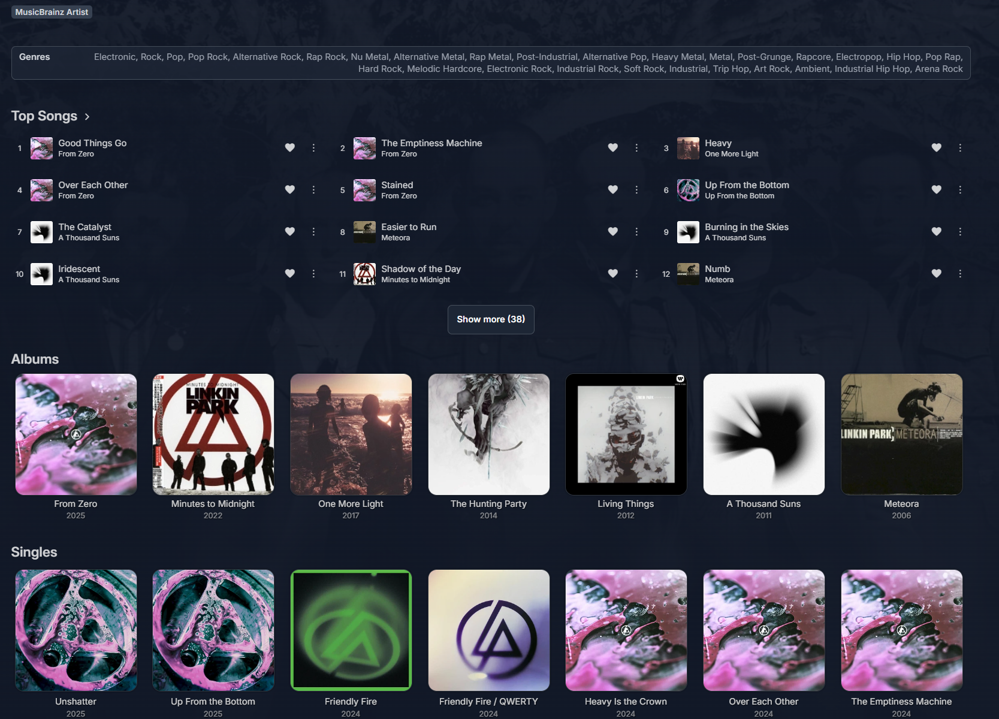

<p align="center">
  
</p>

<h1 align="center">🎵 Artist Pulse for Jellyfin</h1>

<p align="center">
  <strong>Server-wide Top Songs, complete releases, and local Similar Artists on Jellyfin artist pages.</strong>
</p>

<p align="center">
  <a href="LICENSE"></a>
  <a href="https://github.com/0-Pierre/Jellyfin.Plugin.ArtistPulse/releases"></a>
  <a href="https://github.com/jellyfin/jellyfin/releases"></a>
</p>

> Jellyfin users have been asking for most-played tracks directly on artist pages for a long time. [Feature request #1228](https://features.jellyfin.org/posts/1228/add-most-played-tracks-to-artist-window) captures that missing music-page experience. **Artist Pulse solves it today as an opt-in plugin**: no core fork, no modified `jellyfin-web` files, and no external service required for the local server-wide chart.

## ✨ What Artist Pulse adds

- **Top Songs** — compact, ranked artist tracks based on real **server-wide** Jellyfin play counts.
- **One click → a ranked queue** — clicking a Top Song starts at that track, then naturally plays the following available Top Songs.
- **Native interactions** — whole-row playback, current play/pause indicator, favourite state, and item actions use Jellyfin's own Web client APIs and classes.
- **A focused first view** — exactly **12** compact tracks appear first. **Show more** reveals the next ranked tracks; **Show less** returns to 12. This is deliberately not a user-configurable setting.
- **Never a dead row** — only tracks present and playable in the current Jellyfin library are displayed, including when fallback ranking is used.
- **Complete Albums + Singles/EPs** — every release is shown immediately in native-card sections, without an Albums or Singles **More** button.
- **Similar Artists** — ListenBrainz recommendations appear at the bottom only when they exactly match a local Jellyfin artist by MusicBrainz ID. They reuse the local primary image, open the Jellyfin artist page, and display in a full-width circular carousel like Movie Cast & Crew.
- **Theme-friendly UI** — Artist Pulse supplies layout only. Colours, hover effects, typography, cards, and fallback art inherit from Jellyfin Web and the user's theme.
- **ElegantFin tested** — the artist sections have been verified with [ElegantFin](https://github.com/lscambo13/ElegantFin) and its [latest theme stylesheet](https://cdn.jsdelivr.net/gh/lscambo13/ElegantFin@main/Theme/ElegantFin-jellyfin-theme-build-latest-minified.css).

## 🧠 How Top Songs are chosen

1. **Local first (server-wide):** Artist Pulse aggregates Jellyfin `PlayCount` values across all local users for tracks visible to the current user. No local listening data leaves the server.
2. **ListenBrainz completes an incomplete chart:** when the local chart has fewer than 50 tracks, Artist Pulse asks ListenBrainz for public artist popularity using only the artist's public MusicBrainz ID. It appends only unique local matches after the complete local ranking; it never replaces or reorders local results.
3. **Local-library match required:** fallback recordings must match a local track by MusicBrainz recording ID and must not already be in the local chart. Remote-only songs are never shown.
4. **Safe fallback chain:** Artist Pulse uses ListenBrainz artist-page JSON first, then its documented popularity API, then a stale cached response if the service is temporarily unavailable.

## Similar Artists

When ListenBrainz is enabled, Artist Pulse also adds up to 12 related artists at the bottom of an artist page. It requests ListenBrainz artist-page JSON first and falls back to its public artist-radio API. A recommendation is rendered only when its MusicBrainz artist ID exactly matches an artist in the visible Jellyfin library; every card opens that local artist and uses Jellyfin's existing primary image. Remote-only artists and remote artwork are never shown.

The collection replaces Jellyfin Web's **More Like This** section for music artists. It uses a full-width circular carousel with previous/next controls, matching the Movie Cast & Crew experience while leaving the artist-page heading aligned with the music layout.

The result is useful on day one, and becomes more representative as Jellyfin server play history grows.

## ▶️ Ranked queue behaviour

Top Songs are not just links. When you click rank 4, Artist Pulse asks Jellyfin Web to play the complete locally available Top Songs queue at rank 4. When that song ends, normal Jellyfin queue playback continues with rank 5, then rank 6, and so on.

The queue uses only tracks returned by your own Jellyfin server. It never attempts to stream or display a ListenBrainz-only recording.

## 📦 Requirements

| Dependency | Why it is needed | Install / details |
| --- | --- | --- |
| [Jellyfin Server 10.11.x](https://github.com/jellyfin/jellyfin/releases) | Server API and Jellyfin Web compatibility | Keep the plugin version aligned with your Jellyfin release. |
| [File Transformation](https://github.com/IAmParadox27/jellyfin-plugin-file-transformation) | Safely injects the Artist Pulse Web asset references into the served `index.html` | Add its [plugin repository manifest](https://www.iamparadox.dev/jellyfin/plugins/manifest.json), install it, then restart Jellyfin. |
| Music metadata with MusicBrainz IDs | Enables ListenBrainz fallback matching and accurate Album/Single/EP classification | Recommended: artist MBID, recording MBIDs, and release-group IDs. |
| [ListenBrainz](https://listenbrainz.org/) *(optional)* | Public popularity fallback only | No account, token, or scrobbling setup is required. |

Artist Pulse is a **Jellyfin Web** enhancement. Other clients can use its authenticated endpoint, but require their own view implementation to render the feature.

See [dependency details](docs/DEPENDENCIES.md) for compatibility and upgrade notes.

## 🚀 Installation

1. Install **File Transformation** from its [repository manifest](https://www.iamparadox.dev/jellyfin/plugins/manifest.json), then restart Jellyfin.
2. In Jellyfin Dashboard → **Plugins** → **Repositories**, add the Artist Pulse repository URL:

   ```text
   https://raw.githubusercontent.com/0-Pierre/Jellyfin.Plugin.ArtistPulse/main/manifest.json
   ```

3. Open **Catalog**, install **Artist Pulse**, then restart Jellyfin. The **Artist Pulse Web Integration** startup task should complete successfully.
4. Hard-refresh Jellyfin Web (`Ctrl+F5`) and open a music artist page.
5. Configure fallback and release-splitting preferences in Dashboard → Plugins → **Artist Pulse**.

Prefer a manual update? Download the current ZIP from [Releases](https://github.com/0-Pierre/Jellyfin.Plugin.ArtistPulse/releases), remove the older Artist Pulse folder with the same plugin GUID, install the ZIP, and restart Jellyfin.

Detailed local, Docker, and manual-install instructions are in [docs/INSTALLATION.md](docs/INSTALLATION.md).

## ⚙️ Configuration

| Setting | Default | Purpose |
| --- | ---: | --- |
| Enable Artist Pulse in Jellyfin Web | On | Enables the Web integration. |
| Split Singles from Albums | On | Shows Singles/EPs in their own section. |
| Single maximum track count | 3 | Part of the fallback heuristic for releases without type metadata. |
| Single maximum duration | 30 minutes | Prevents long short-track albums being classified as singles. |
| Use ListenBrainz for Top Songs and Similar Artists | On | Appends unique, locally playable public-popularity matches after local ranked tracks when fewer than 50 tracks are available, and supplies cached similar-artist recommendations. |
| ListenBrainz cache | 24 hours | Fresh-cache lifetime. Stale cache remains available during outages. |

Top Songs always begins with 12 rows, then expands on demand. This guarantees a consistent artist-page layout for every user.

## 🔒 Privacy, caching, and rate limits

Artist Pulse is built around the fact that listening history is personal:

- Jellyfin play counts and favourites stay on your server. Play counts are aggregated for the server-wide chart; favourite state remains personal to the signed-in user.
- ListenBrainz receives only a public MusicBrainz artist ID—never a Jellyfin user, token, path, library name, or local play history.
- Responses are cached on disk inside Jellyfin's plugin configuration area.
- Both the artist-page JSON request and the documented popularity API share one process-wide request gate, with at least one second between remote requests.
- HTTP 429 responses honour `Retry-After` when present; otherwise Artist Pulse backs off for one minute and serves stale cache where possible.

Read the full [privacy and network behaviour](docs/PRIVACY.md).

## 🧩 Troubleshooting

| Symptom | Check |
| --- | --- |
| No Artist Pulse section | Ensure File Transformation is installed, restart Jellyfin, run **Artist Pulse Web Integration**, then hard-refresh the browser. |
| Startup task says File Transformation is missing | Install a File Transformation release compatible with your Jellyfin version. |
| Fallback section is empty | Confirm the artist has a MusicBrainz artist ID and local tracks have recording MBIDs. Artist Pulse intentionally excludes unavailable remote recordings. |
| Singles are still inside Albums | Refresh metadata first; otherwise tune the release track-count and duration heuristic. |
| Similar Artists are absent | Confirm ListenBrainz is enabled, the source artist has a MusicBrainz artist ID, and at least one recommended artist exists locally with the same MusicBrainz artist ID. |
| Similar Artist arrows are disabled | All matching cards already fit in the viewport. The arrows activate only when additional cards are off-screen. |
| Old layout remains | Clear browser cache / hard-refresh after plugin or Jellyfin Web updates. |

For diagnostics and logs, see [docs/INSTALLATION.md#troubleshooting](docs/INSTALLATION.md#troubleshooting).

## 🗺️ Documentation

- [Installation and troubleshooting](docs/INSTALLATION.md)
- [Dependencies and compatibility](docs/DEPENDENCIES.md)
- [Privacy, caching, and network behaviour](docs/PRIVACY.md)
- [Contributing](CONTRIBUTING.md)
- [Security policy](SECURITY.md)
- [Changelog](CHANGELOG.md)

## 🤝 Credits

- [Jellyfin](https://jellyfin.org/) and its music community.
- [File Transformation](https://github.com/IAmParadox27/jellyfin-plugin-file-transformation) for non-destructive Jellyfin Web integration.
- [MusicBrainz](https://musicbrainz.org/) and [ListenBrainz](https://listenbrainz.org/) for open music metadata and public popularity data.

## 📜 License

Artist Pulse is licensed under [GPL-3.0-or-later](LICENSE).
